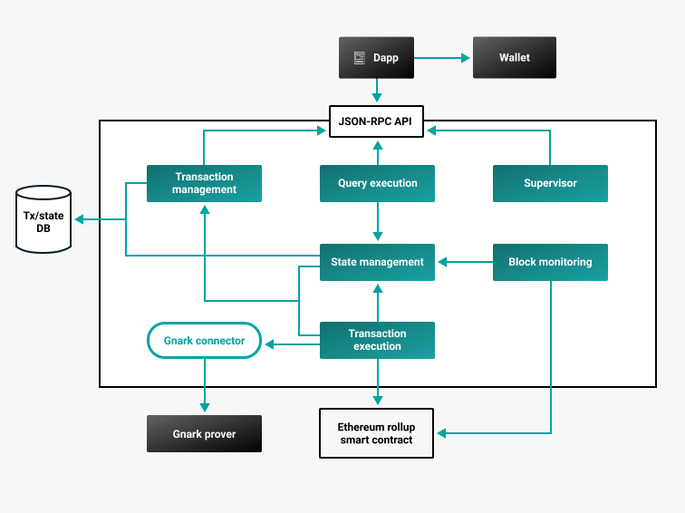

# ConsenSys Rollups architecture

The following diagram outlines the ConsenSys Rollups high-level architecture.
In particular, it highlights the communication between the manager and engine components.

Communication between manager and engine is asynchronous due to the nature of interactions with the blockchain.
The steps are as follows.

1. The manager accepts a request from a dapp and does some preliminary validation.
1. The manager computes the operation hash using a cryptographic library.
1. The manager saves the pending operation on its local database.
1. The engine registers the request from the manager if it passes some initial validation.
1. After executing operations, the engine submits the batch to the blockchain.
1. When a request is submitted to a blockchain, and a "Batch Submitted" event is received, the engine sends batch
   information to a Kafka topic.
   Each operation in the batch data contains an operation hash, so the manager can map it to particular request from the user.
1. When the engine receives a "Batch Finalized" event, it sends a message to a Kafka topic, which includes the batch height.
1. When the manager receives a "Batch Finalized" message from Kafka, it updates its local database.

For more information about the ConsenSys Rollups architecture, contact us on [ConsenSys Rollups Discord channel](https://discord.gg/9mCVSY6).
