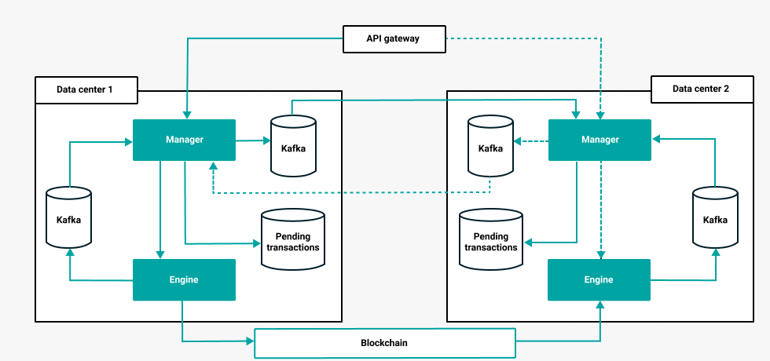

# High availability

You can configure ConsenSys Rollups to be highly available by having multiple instances of the same
operator. If one operator goes down, then the other instance continues to process batches and
operations from the accounts managed by the operator.

!!! note

    Multiple operators in a rollup due not offer high availability because operators can manage different
    accounts.

## Overview

In the following high availablity example, an operator has multiple instances, with each
instance in a separate data center.

All incoming operations such as money order creations, money order redemptions, and account redemptions
are replicated to all operator instances. Operations are replicated using Kafka streams, the
operator's manager saves incoming operations to a Kafka topic (`pending-operations) `before forwarding
to the engine.

Each instance saves the incoming operation in its own Kafka topic, and the other instance replays the
the operation from the other instance. This ensures that every instance will have all the operations
submitted to the operator, and they will eventually be executed regardless of the instance that submits
the batch to the rollup smart contract.

Each engine instance listens to the rollup smart contract events and populates the Kafka `batch-updates`
topic, meaning all manager instances are up to date. The manager detects when the engine fails and
reports the operators as failing. This way the API load balancer or gateway can forward the request
to another instance.

## High availability modes

Highly available operator instances acn run in either active-active mode, or active-passive mode.

The active-passive mode may prove to be more effecient due to:

* Not wasting CPU cycles keeping multiple provers running.
* Not spending gas fees by submitting concurrent batches (when only one will succeed).

!!! note

   A blockchain is asynchronous, meaning active-passive can still lead to multiple batch creations
   at the same time.

## Multi-site configuration

Multi-site high availability configuration allows the system to remain available in the case of
site-wide failures.

To ensure zero data loss, leverage Kafka to replicate data across multiple sites. Each site must have
its own independent Kafka cluster to save the pending operations. The `pending-operations` topics must
have a replication factor of 2 or more, and each cluster must have at least one replica located in
another site.

Kafka must be replicated with a strategy that ensures that a single site failure does not block the
system.

!!! note

    Synchronous writes ensure that there is no data loss, but are usually very expensive, both in terms
    of the hardware and network requirements, and system latency.
