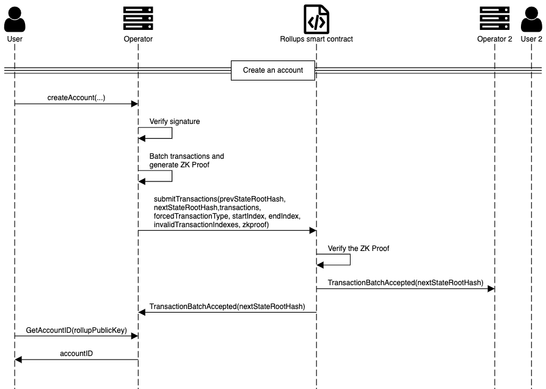
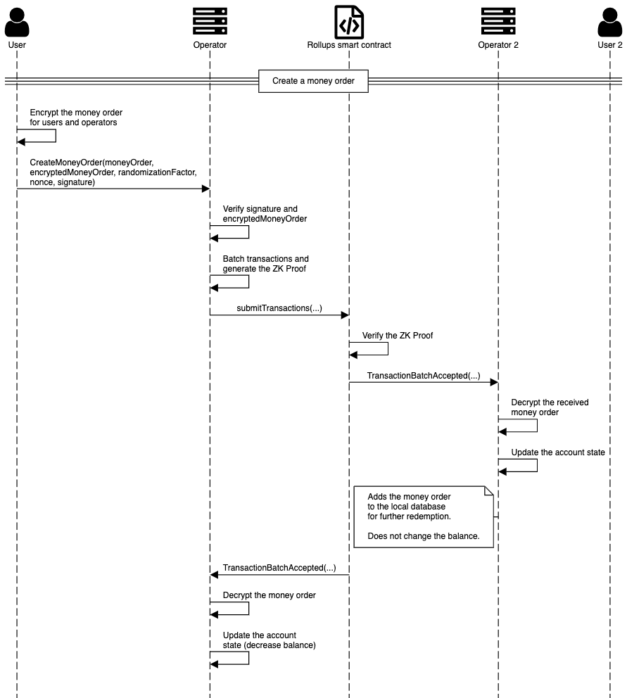
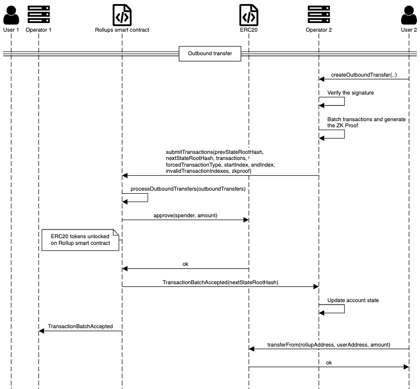
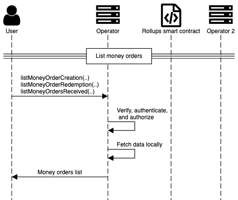
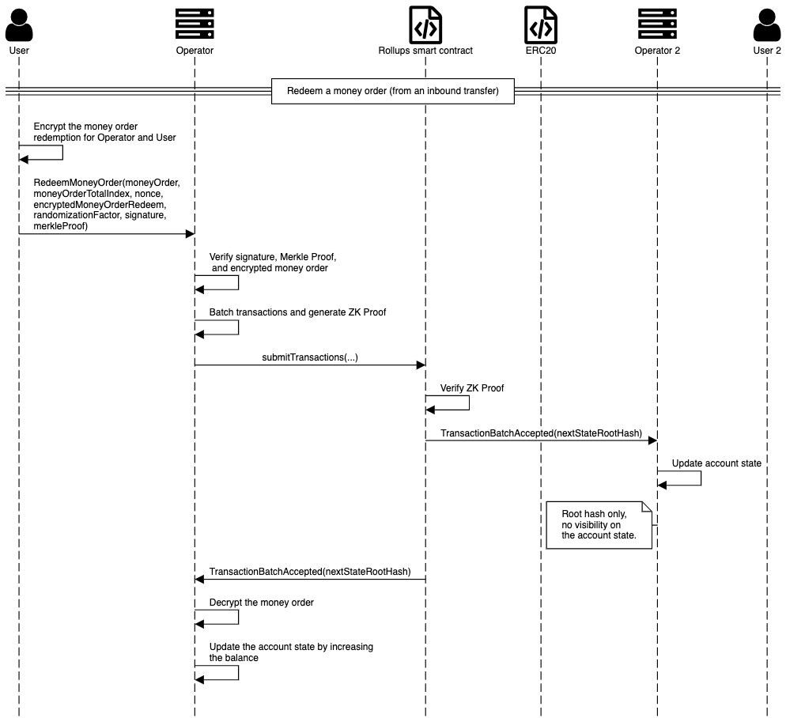

# Workflow sequence for common operations

This topic illustrates the event sequence for common rollup operations across the network.

## Create an account

Create an account with the [`createAccount`](../Reference/JSON-RPC.md#createaccount) JSON RPC API.

## Create a money order

Create a money order with the [`createMoneyOrder`](../Reference/JSON-RPC.md#createmoneyorder) JSON RPC API.

The money order is encrypted before being sent to the operator.

## Create an outbound transfer

An outbound transfer is when funds are transferred from a rollup account to an Ethereum address.

Operators receive outbound transfer requests, check them for validity, create batches of them and batch
proofs.

## List money orders

You can list money orders by their status with the following JSON RPC APIs:

* [`listMoneyOrderCreations`](../Reference/JSON-RPC.md#listmoneyordercreations)
* [`listMoneyOrdersReceived`](../Reference/JSON-RPC.md#listmoneyordersreceived)
* [`listMoneyOrderRedemptions`](../Reference/JSON-RPC.md#listmoneyorderredemptions)

## Redeem a money order

Redeem a [money order] with the [`redeemMoneyOrder`](../Reference/JSON-RPC.md#redeemmoneyorder) JSON RPC API.

Money orders for redemption can be created in the following ways:

* External funds that enter the rollup as an [inbound transfer](#register-an-inbound-transfer).
* Money orders [created in the rollup](#create-a-money-order).

The following example redeems a money order from an inbound transfer.

## Register an inbound transfer

Inbound transfers are when funds are transferred from an Ethereum address to the rollup. That means funds
enter the rollup, and existing rollup accounts can later be credited with the external funds.

An inbound transfer sends funds directly from an Ethereum address to the rollup smart contract

## Register a token

A rollup administrator can call the rollup smart contract to register an ERC20 token.

## Submit a forced outbound transfer

A forced outbound transfer has to be processed before it expires.

[money order]: Money-Order.md
