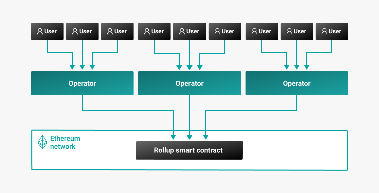
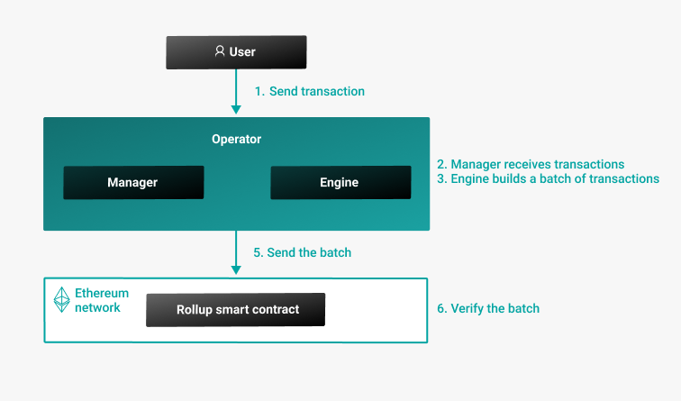

# ConsenSys Rollups

## What is ConsenSys Rollups?

ConsenSys Rollups is a framework for implementing multiple types of rollups for the Ethereum
blockchain. Rollups are layer 2 scaling solutions that improve the scalability of Ethereum
networks by performing mass transaction validation off-chain. ConsenSys Rollups supports any EVM-based protocol,
including Proof of Work (PoW) and Proof of Authority (PoA) protocols.

ConsenSys Rollups currently implements [consensus-rollups](Concepts/Rollups/Consensus.md) and
[partially anonymous rollups](Concepts/Rollups/Partially-Anonymous-Rollups.md), with support for an additional type
of rollup (optimistic-rollups) being added later.

ConsenSys Rollups introduces a centralized actor called an operator which consists of a manager and engine.
The operator receives and executes transactions, manages the state, and submits batch transactions
to the Ethereum network.

Blockchain nodes do not re-execute the transactions; they wait until the operators reach consensus.

## Why use ConsenSys Rollups?

ConsenSys Rollups provides approximate speeds of 10,000 transactions per second (TPS)
with 100 million accounts, on a private blockchain with immediate finality producing 1 block per
second.
